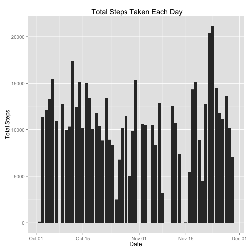
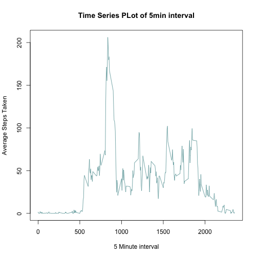
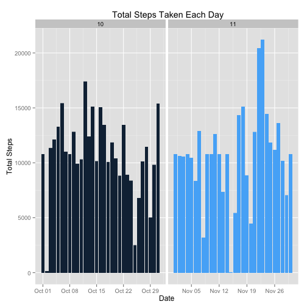
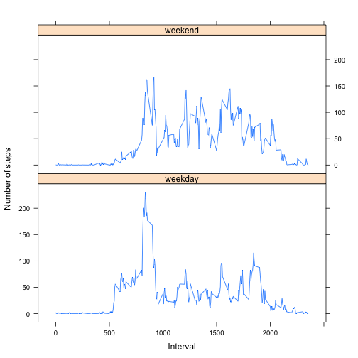

#Reproducible Research Assignment1

##Loading and preprocessing the data

```r
activity_data <- read.csv("~/Programs/Coursera/Reproducible Research/activity.csv",header = TRUE,colClasses = c("integer", "Date", "factor"))
#creating month column for plotting purpose
activity_data$month <- as.numeric(format(activity_data$date,"%m"))
```

##Plotting and calculating mean and median total number of steps taken per day
- Plotting


```r
#Ignoring missing values from the data set
activity_data_NoNA <- subset(activity_data,steps !='NA')
#plotting the values with ggplot
library(ggplot2)
ggplot(activity_data_NoNA,aes(activity_data_NoNA$date,activity_data_NoNA$steps)) + geom_bar(stat="identity") +  xlab("Date") + ylab("Total Steps") + ggtitle(" Total Steps Taken Each Day")
```

 

- Mean and Median

```r
#Aggregating the dataset
activity_data_NoNA_agg <- aggregate(x= activity_data_NoNA[c("steps")],FUN=sum,by=list(activity_data_NoNA$date))
#Calculating the mean
data_mean <-mean(activity_data_NoNA_agg$steps)
data_mean
```

```
## [1] 10766.19
```

```r
#Calculating the Median
data_median <-median(activity_data_NoNA_agg$steps)
data_median
```

```
## [1] 10765
```

##average daily activity pattern


```r
#Assumption : Ignoring the NA values
#Average of the steps against each interval
activity_NoNA_average  <- aggregate(activity_data_NoNA$steps, list(interval = as.numeric(as.character(activity_data_NoNA$interval))), FUN = "mean")
#Assigning Column names
colnames(activity_NoNA_average) <- c("interval","AvgSteps")
#plotting the values 
plot(activity_NoNA_average$AvgSteps~activity_NoNA_average$interval ,activity_NoNA_average,type='l',main ="Time Series PLot of 5min interval",xlab = "5 Minute interval", ylab="Average Steps Taken",col="cadetblue")
```

 

```r
#5-minute interval on average across all the days in the dataset that  contains the maximum number of steps
activity_NoNA_average[ activity_NoNA_average$AvgSteps == max(activity_NoNA_average$AvgSteps) , ]
```

```
##     interval AvgSteps
## 104      835 206.1698
```

##Imputing missing values

```r
#total number of missing values in the dataset
sum(is.na(activity_data))
```

```
## [1] 2304
```
-Creating a new dataset that is equal to the original dataset but with the missing data filled in


```r
# As we have already calculated 5 min average interval , those values will be taken to replace the NA values
#copying the activity data
new_activity_data <- activity_data
#merging new acitivity data and activity NoNA average datasets by the column "interval"
merge_activity_data <- merge(new_activity_data,activity_NoNA_average, by=c("interval"), all=TRUE)
#Rounding the Average steps to 2 decimals
merge_activity_data$AvgSteps <- round(merge_activity_data$AvgSteps, digits = 2)
#Assigining average value to NA value for a row
merge_activity_data$steps[is.na(merge_activity_data$steps)] <- as.character(merge_activity_data$AvgSteps[is.na(merge_activity_data$steps)])
#Formatting the columns
merge_activity_data$steps <- as.numeric(format(merge_activity_data$steps))
merge_activity_data$interval <- as.integer(format(merge_activity_data$interval))
#sorting the dataset
merge_activity_data <- merge_activity_data[order(merge_activity_data$date,merge_activity_data$interval) , ]
head(merge_activity_data)
```

```
##       interval steps       date month AvgSteps
## 1            0  1.72 2012-10-01    10     1.72
## 13727        5  0.34 2012-10-01    10     0.34
## 67          10  0.13 2012-10-01    10     0.13
## 4414        15  0.15 2012-10-01    10     0.15
## 8255        20  0.08 2012-10-01    10     0.08
## 11856       25  2.09 2012-10-01    10     2.09
```

- Plotting with above data set

```r
ggplot(merge_activity_data,aes(date,steps,fill=month)) + geom_bar(stat="identity") +  facet_grid(. ~ month , scales = "free") + xlab("Date") + ylab("Total Steps") + ggtitle(" Total Steps Taken Each Day") + scale_fill_gradient(breaks=unique(merge_activity_data$month)) + guides(fill=FALSE)
```

 

-Mean and Median for the new data set

```r
#Aggregating the dataset
new_activity_data_agg <- aggregate(x= merge_activity_data[c("steps")],FUN=sum,by=list(merge_activity_data$date))
#Calculating the mean
new_mean <-mean(new_activity_data_agg$steps)
new_mean
```

```
## [1] 10766.18
```

```r
#Calculating the Median
new_median <- median(new_activity_data_agg$steps)
new_median
```

```
## [1] 10766.13
```
- Comparing Mean and Median for the new data set and Old data set

```r
#comparing Means
activity_mean <- c(data_mean,new_mean)
activity_mean
```

```
## [1] 10766.19 10766.18
```

```r
#comparing Medians
activity_median <- c(data_median,new_median)
activity_median
```

```
## [1] 10765.00 10766.13
```
- From above, we can conclude that after imputing the missing values, mean doesnt change but medianincremented by approx 1 value

##differences in activity patterns between weekdays and weekends

```r
#new column and changing to factor
merge_activity_data$week <- weekdays(merge_activity_data$date)
merge_activity_data$week <- as.factor(merge_activity_data$week)
#creating levels
levels(merge_activity_data$week) <- list(weekday =c("Monday","Tuesday","Wednesday","Thursday","Friday"),weekend =c("Saturday","Sunday"))
#calculating Average
merge_activity_avg  <- aggregate(merge_activity_data$steps, list(interval = as.numeric(as.character(merge_activity_data$interval)),week=merge_activity_data$week), FUN = "mean")
#assigning column names
colnames(merge_activity_avg) <- c("interval","week","AvgSteps")

library(lattice)
#plotting the data
xyplot(merge_activity_avg$AvgSteps ~ merge_activity_avg$interval | merge_activity_avg$week ,layout = c(1,2),type="l",  xlab = "Interval", ylab = "Number of steps")
```

 
